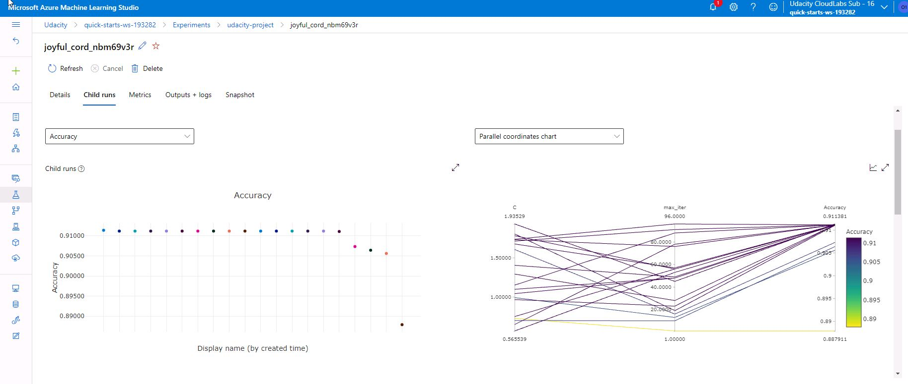
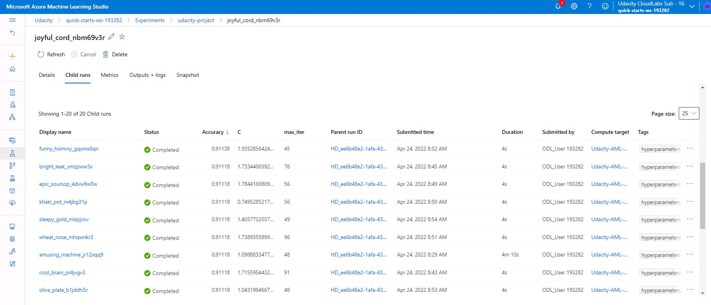
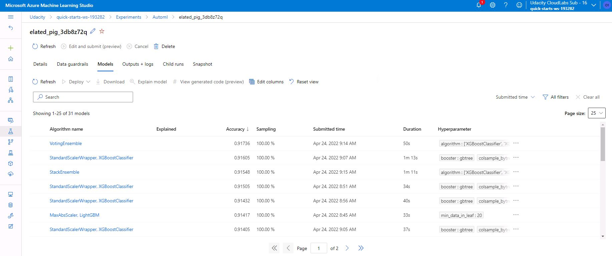

# Optimizing an ML Pipeline in Azure

## Overview
This project is part of the Udacity Azure ML Nanodegree.
In this project, we build and optimize an Azure ML pipeline using the Python SDK and a provided Scikit-learn model.
This model is then compared to an Azure AutoML run.

## Summary
The 'Bank Marketing Data Set' provides information about bank customers with their individual characteristics (job, age, education, last contact, etc.).
We seek to predict if a customer opens a term deposit account. This is a classification task and we want to find customers with the maximum likelihood to open a deposit account.

The best performing model was found by the AutoML experiment as a VotingEnsemble (XGBoostClassifier) with an accuracy of 91.736%
XGBoost is an ensembling algorithm, that concats multiple predictors. 
Each of them is trained to interpret and improve the output of the the previous predictor.
By the combination of all predictors, it is often a powerful estimator and therefore gets a lot of research attention.
Also here, the algorithm was able to perform best.

## Scikit-learn Pipeline
The pipeline trains multiple models with different hyperparameters and returns the best model with the best hyperparameter configuration for our optimization goal.
For each model instance the dataset is loaded and cleansed.
Afterward, the scikit-learn implementation for the LogisticRegression algorithm is trained, with repsect to the given hyperparameters.
Therefore, the pipeline randomly selects hyperparameter values (grid search).

The chosen algorithm is the logistic regression (https://en.wikipedia.org/wiki/Logistic_regression). This algorithm fits a function to return values between 0 and 1 with respect to our optimization goal. We want 0 values for customers that are not likely to open a deposit account, and vice versa, 1 values for customers with a high likelihood.
This algorithm has parameters like the C value (the regularization strength for the regression) and the number of optimization steps.
Both hyperparameters are sampled from random uniform distributions, because both hyperparameters are continuous values. Therefore, the RandomParameterSampler was chosen.

To find the end of an experiment, a technique called 'early stopping' is commonly used. 
During the training steps, the accuracy of a model varies. During training, the model learns the interrelationships in the data and gets better over time until we reach a local optimum. If we continue training, the model accuracy decreases (and we may run into an overfit).
An early stopping policy ends the training in such a local optimum, if the model could not find a better optimum with a number of training steps.
This is implemented by the BanditPolicy class in Azure, that specifies the minimum improvement that is necessary in a specified amount of training steps, to continue the training process.

The images below show the results of the Hyperdrive run. In the first image, the accuracy of miltuple models with their hyperparameters can be seen. The second image shows the distinct hyperparameters in a tabular form.

## AutoML
AutoML trains multiple types of machine learnings and compare them agianst each other.
Many tree-based algorthms were used and the VotingEnsamle model based on the XGBoostClassifier (https://en.wikipedia.org/wiki/Boosting_(machine_learning) with default parameters showed the best results.

The image below shows multiple models of the AutoML run with their architecture and accuracy.

## Pipeline comparison
The performance of both models are very similar (~91% accuracy). The AutoML run with the VotingEnsamle shows a slightly higher accuracy of 91.736% in contrast to the scikit-learn pipeline with the logistic regression with 91.138 % accuracy.
This difference can be explained with the boosting technique in the XGBoost algorithm. This combines multiples models, so that each model improves the result of the previous model. In total, this algorithm can learn a significant higher amount of complexity in the data, in comparison to a single predictor like the logistic regression.

## Future work
Further improvement may be possible by longer AutoML runs, that compare more models, also with different hyperparameter combinations.
An additional improvement can be achieved by further feature engineering. The dataset is not balanced (the number of instances for each class is not equal). This can result in a bias in these models.

## Proof of cluster clean up

 
 

## Resources
- https://docs.microsoft.com/de-de/python/api/azureml-train-core/azureml.train.hyperdrive?view=azure-ml-py
- https://docs.microsoft.com/de-de/python/api/azureml-core/?view=azure-ml-py
- https://github.com/microsoft/MLHyperparameterTuning
- https://github.com/MicrosoftDocs/azure-docs/blob/main/articles/machine-learning/how-to-train-scikit-learn.md
- https://docs.microsoft.com/en-us/python/api/azureml-train-core/azureml.train.sklearn.sklearn?view=azure-ml-py
- https://docs.microsoft.com/de-de/azure/machine-learning/how-to-tune-hyperparameters
- https://github.com/MicrosoftDocs/azure-docs/blob/main/articles/machine-learning/how-to-configure-auto-train.md
